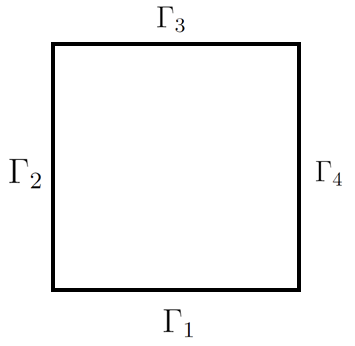
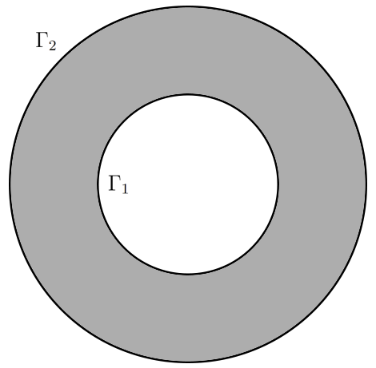

# PINN (Physics-Informed Neural Network)
Code for solving various PDEs with PINN.

Solutions are compared to exact solution or FEM solution.

Here is a list of equations that are solved:
1. File 1DLinearPINN.py solves 1D linear Puasson's equation:

<!-- $$
-(k(x)p')'= f(x), x \in (0,1),
$$ --> 

<!-- $$
p(0)=p(1)=0,
$$ --> 

 

<!-- $$
k(x,p)=1+xp,f(x)=-1.
$$ --> 

2. File 1DNonLinearPINN.py solves 1D Nonlinear Puasson's equation:

<!-- $$
-(k(x,p)p')'= f(x), x \in (0,1),
$$ --> 

 

<!-- $$
p(0)=p(1)=0,
$$ --> 

<!-- $$
k(x)=\frac{1}{4+sin(2\pi x)}, f(x)=1.
$$ --> 

3. File 2DPlus1DPlot.py solves 2D linear Puasson's equation:
<!-- $$
\bigtriangleup u = f(x), \quad x \in \Omega = (0, 1) \times (0, 1),
$$ --> 

<!-- $$
u = 0\text{ on }\Gamma_1\text{ and }\Gamma_3,
$$ --> 

<!-- $$
\frac{\partial u}{\partial n} = 0\text{ on }\Gamma_2\text{ and }\Gamma_4,
$$ --> 

<!-- $$
f(x)=-\pi sin(\pi x_1)sin(\pi x_2).
$$ --> 

    

and analogous 1D linear Puasson's equation:

<!-- $$
\bigtriangleup u = f(x), \quad x \in \Omega = (0, 1),
$$ --> 

<!-- $$
u(0) = u(1) = 0,
$$ --> 

<!-- $$
f(x)=-\pi sin(\pi x).
$$ --> 

4. File 2DPlus1DPlotZeroF.py solves 2D linear Laplace's equation:
<!-- $$
\bigtriangleup u = 0, \quad x \in \Omega = (0, 1) \times (0, 1),
$$ --> 

<!-- $$
u = 1\text{ on }\Gamma_1, u = 0\text{ on }\Gamma_3,
$$ --> 

<!-- $$
\frac{\partial u}{\partial n} = 0\text{ on }\Gamma_2\text{ and }\Gamma_4.
$$ --> 

    

and analogous 1D linear Laplace's equation:
<!-- $$
\bigtriangleup u = 0, \quad x \in \Omega = (0, 1),
$$ --> 

<!-- $$
u = 1\text{ when } x = 0,
$$ --> 

<!-- $$
u = 0\text{ when } x = 1.
$$ --> 

5. File 2DPlus1DPlotZeroFHalfDirichlet.py solves 2D linear Laplace's equation:
<!-- $$
\bigtriangleup u = 0, \quad x \in \Omega = (0, 1) \times (0, 1),
$$ --> 

<!-- $$
u = 0\text{ on }\Gamma_1\text{ and }\Gamma_4,
$$ --> 

<!-- $$
u = 1\text{ on }\Gamma_2\text{ and }\Gamma_5,
$$ --> 

<!-- $$
\frac{\partial u}{\partial n} = 0\text{ on }\Gamma_3\text{ and }\Gamma_6.
$$ --> 

    

6. File 2DRobin.ipynb solves Laplace's 2D equation:

<!-- $$
\bigtriangleup u = 0, \quad x \in \Omega = (0, 1) \times (0, 1),
$$ --> 

<!-- $$
u = 0\text{ on }\Gamma_1, 
$$ --> 

<!-- $$
\frac{\partial u}{\partial n} = u\text{ on }\Gamma_2, 
$$ --> 

<!-- $$
u = 1\text{ on }\Gamma_3, 
$$ --> 

<!-- $$
\frac{\partial u}{\partial n} = 0\text{ on }\Gamma_4.
$$ --> 

    

7. File 1DNonStationaryHeatEquation.ipynb solves non-stationary 1D heat equation:

<!-- $$
\frac{\partial u}{\partial t} = \frac{\partial^2 u}{\partial x^2}, \quad (x,t) \in \Omega = (0, 1)^2 \times (0, 0.2),
$$ --> 

<!-- $$
u(0, t) = 0,
$$ --> 

<!-- $$
u(1, t) = 0,
$$ --> 

<!-- $$
u(x, 0) = \sin(\pi x) - \sin(2 \pi x) + \sin(3 \pi x).
$$ --> 

8. File 2DNonStationaryHeatEquation.ipynb solves non-stationary 2D heat equation:

<!-- $$
\frac{\partial u}{\partial t} = 0.01\bigtriangleup u, \quad (x,t) \in \Omega = (0, 1)^2\times (0, 2),
$$ --> 

<!-- $$
u(0, x_2, t) = u(x_{1 max},x_2, t) = u(x_1, 0, t) = u(x_1, x_2, 0) = 0,
$$ --> 

<!-- $$
u(x_1, x_{2 max}, t) = 1.
$$ --> 

9. File 1DStationaryHeatEquationRing.ipynb solves 2D Laplace's equation with Dirichlet conditions in double-connected region

<!-- $$
\Gamma_1=\{x_1(\varphi)=(2cos(\varphi), 2sin(\varphi)), \varphi \in [0, 2\pi]\},
$$ --> 

<!-- $$
\Gamma_2=\{x_2(\varphi)=(5cos(\varphi), 5sin(\varphi)), \varphi \in [0, 2\pi]\},
$$ --> 

<!-- $$
\bigtriangleup u=0\text{ in }D,
$$ --> 

<!-- $$
u=x\text{ on }\Gamma_1,
$$ --> 

<!-- $$
u=0\text{ on }\Gamma_2.
$$ --> 

    

<!-- $$
u((x_1, x_2), 0) = \sin(\pi x_1) - \sin(2 \pi x_2) + \sin(3 \pi x_1).
$$ -->
<!-- 9.  File 1DSpecialNonStationaryHeatEquation.ipynb solves non-stationary 1D heat equation:
$$
div(\lambda grad u)=c\rho\frac{\partial u}{\partial \tau},
$$

$$
\frac{\partial u}{\partial n}=0\text{ at }x = 0,
$$

$$
\lambda\frac{\partial u}{\partial n}=\alpha(u-u_c)\text{ at }x=R,
$$

$$
\lambda = 0.557*10^{-7} \frac{W}{m K}, 
$$

$$
c\rho=1 \frac{J}{m^3 K}, 
$$

$$
\alpha=0.592*10^{-3} \frac{W}{m^2K}, 
$$

$$
r=0.141m, 
$$

$$
u_0=323 \degree K,
$$

$$
u_c=823(1-0.5473*e^{-53.6\tau}).
$$ -->