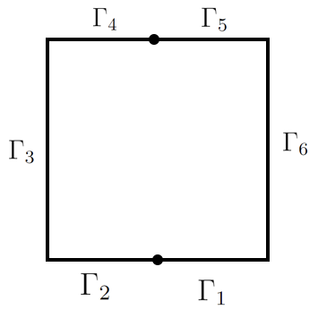

# PINN (Physics-Informed Neural Network)
Code for solving various PDEs with PINN.

Solutions are compared to exact solution or FEM solution.

Here is a list of equations that are solved:
1. File 1DLinearPINN.py solves 1D linear Puasson's equation:
<!-- $$
-(k(x)'p)'= f(x), x \in (0,1),
$$ --> 

<!-- $$
p(0)=p(1)=0,
$$ --> 

 

<!-- $$
k(x,p)=1+xp,f(x)=-1.
$$ --> 

2. File 1DNonLinearPINN.py solves 1D Nonlinear Puasson's equation:
<!-- $$
-(k(x,p)'p)'= f(x), x \in (0,1),
$$ --> 

<!-- $$
p(0)=p(1)=0,
$$ --> 

<!-- $$
k(x)=\frac{1}{4+sin(2\pi x)}, f(x)=1.
$$ --> 

3. File 2DPlus1DPlot.py solves 2D linear Puasson's equation:
<!-- $$
\bigtriangleup u = f(x), \quad x \in \Omega = (0, 1) \times (0, 1),
$$ --> 

<!-- $$
u = 0\text{ on }\Gamma_1\text{ and }\Gamma_3,
$$ --> 

<!-- $$
\frac{\partial u}{\partial n} = 0\text{ on }\Gamma_2\text{ and }\Gamma_4,
$$ --> 

<!-- $$
f(x)=-\pi sin(\pi x_1)sin(\pi x_2).
$$ --> 

and analogous 1D linear Puasson's equation:

<!-- $$
\bigtriangleup u = f(x), \quad x \in \Omega = (0, 1),
$$ --> 

<!-- $$
u(0) = u(1) = 0,
$$ --> 

<!-- $$
f(x)=-\pi sin(\pi x).
$$ --> 

4. File 2DPlus1DPlotZeroF.py solves 2D linear Laplace's equation:
<!-- $$
\bigtriangleup u = 0, \quad x \in \Omega = (0, 1) \times (0, 1),
$$ --> 

<!-- $$
u = 1\text{ on }\Gamma_1, u = 0\text{ on }\Gamma_3,
$$ --> 

<!-- $$
\frac{\partial u}{\partial n} = 0\text{ on }\Gamma_2\text{ and }\Gamma_4.
$$ --> 

and analogous 1D linear Laplace's equation:
<!-- $$
\bigtriangleup u = 0, \quad x \in \Omega = (0, 1),
$$ --> 

<!-- $$
u = 1\text{ when } x = 0,
$$ --> 

<!-- $$
u = 0\text{ when } x = 1.
$$ --> 

5. File 2DPlus1DPlotZeroFHalfDirichlet.py solves 2D linear Laplace's equation:
<!-- $$
\bigtriangleup u = 0, \quad x \in \Omega = (0, 1) \times (0, 1),
$$ --> 

<!-- $$
u = 0\text{ on }\Gamma_1\text{ and }\Gamma_4,
$$ --> 

<!-- $$
u = 1\text{ on }\Gamma_2\text{ and }\Gamma_5,
$$ --> 

<!-- $$
\frac{\partial u}{\partial n} = 0\text{ on }\Gamma_3\text{ and }\Gamma_6.
$$ --> 

    

6. File 2DPlus1DPlotRobin.ipynb solves non-stationary 1D heat equation:

$$
\bigtriangleup u = 0, \quad x \in \Omega = (0, 1) \times (0, 1),
$$

$$

$$